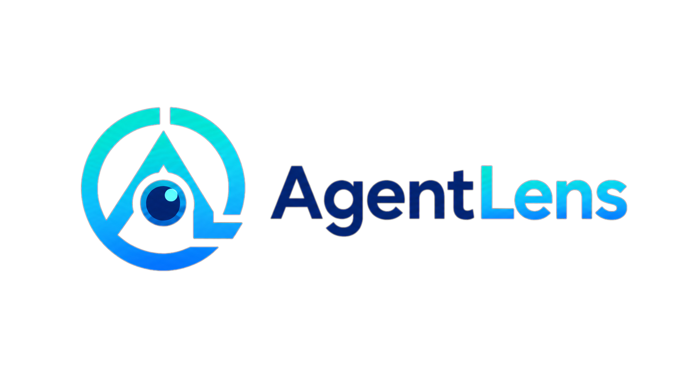
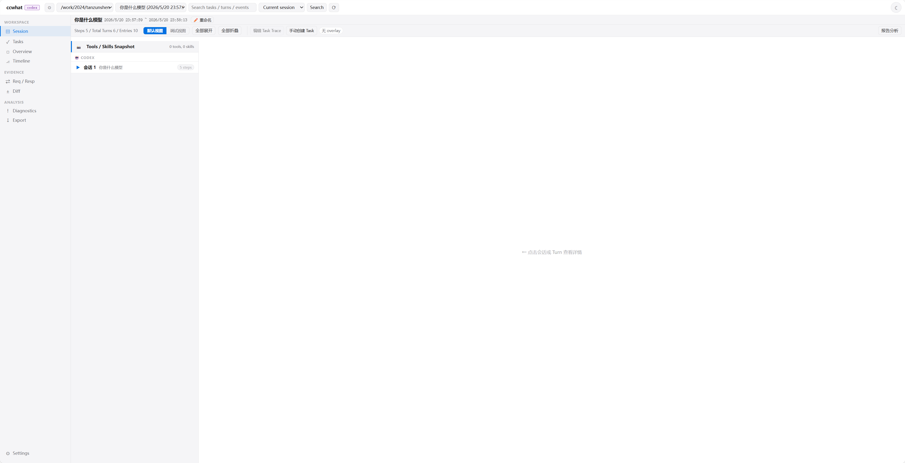

<div align="center">

<a href="https://github.com/PacemakerG/CCWhat">
  <picture>
    <source media="(prefers-color-scheme: dark)" srcset="./assets/readme/logo-dark.png">
    <source media="(prefers-color-scheme: light)" srcset="./assets/readme/logo-light.png">
    
  </picture>
</a>

<h3>End-to-end tracing and observability for AI agents.</h3>

<p>
  <strong>Languages:</strong>
  <a href="./README.md">简体中文</a> ·
  <a href="./README.en.md">English</a>
</p>

<p>
  <strong>Changelog:</strong>
  <a href="./CHANGELOG.md">v2.3.2</a> ·
  <a href="./CHANGELOG.md">Changelog</a>
</p>

</div>

## Preview

| Dark | Light |
| :---: | :---: |
|  |  |

## 😤 Sound familiar?

- You tell Claude Code to go left, but it goes right and invents a third direction
- You ask it to “reference this document,” and it immediately says it did—without opening the file
- You ask, “Did you actually read it?” and it confidently says, “Yes.”
- You dig through terminal logs but still cannot find solid evidence of what it did

**Stop guessing what an agent did. Inspect every step.**

## ❓ What is AgentLens?

AgentLens has one core job:

> **Record every small move an AI makes while working and show it in a browser as it happens.**

- Which tools it called
- Which files it read—or claimed to read without actually reading
- Which commands it ran and what they returned
- Whether it truly referenced the documentation or made up an answer

**Every action, in plain sight.**

AgentLens brings native agent Session logs and model request records into one Viewer, making execution traces searchable, comparable, replayable, and exportable.

## ✨ What can AgentLens do?

### Inspect complete execution traces

Navigate user requests, agent replies, reasoning, tool calls, and tool results through a `Session → Task → Conversation → Step / Turn` hierarchy. The default view highlights primary execution steps, while the debug view preserves the complete event timeline.

### Find critical context

Search Sessions, Tasks, Turns, and events within the current Session, the current project, or every project, then jump directly to a result. Inspect the actual model request and streaming response from the Request / Response page.

### Compare and replay

Compare adjacent Turns to find added, removed, or changed context fields. Historical requests containing a real user message can be replayed as-is or resent with an edited Prompt to validate behavior and compare alternatives.

### Segment and refine Tasks

Split long Sessions automatically with local rules, create Tasks manually, or adjust, split, merge, and remove Task boundaries to produce a trace that is easier to review.

### Generate reports and Datasets

Generate an analysis report from the current Session. Save confirmed Tasks as a standard Dataset containing `manifest.json`, `dataset.jsonl`, `traces/*.json`, and `scores.jsonl` for downstream evaluation, analysis, or training-data conversion.

### Export and share evidence

Export Sessions and related request records as an archive. Import the archive later and open it in the Viewer to reproduce issues or investigate them with others.

## 🚀 Installation

### Requirements

- macOS, Linux, WSL, or native Windows PowerShell
- Python 3.10+
- A working `mitmdump` command for local HTTP / HTTPS recording

The Bash installer supports macOS, Linux, and WSL. Use the PowerShell steps below for native Windows.

### macOS / Linux / WSL install or update

```bash
curl -fsSL https://raw.githubusercontent.com/PacemakerG/CCWhat/main/install.sh | bash
```

### Windows PowerShell install or update

Use `uv` or `pipx` to install into an isolated environment:

```powershell
uv tool install git+https://github.com/PacemakerG/CCWhat.git
uv tool install mitmproxy
```

With `pipx`:

```powershell
pipx install git+https://github.com/PacemakerG/CCWhat.git
pipx install mitmproxy
```

With Python's built-in pip:

```powershell
py -m pip install --user git+https://github.com/PacemakerG/CCWhat.git
py -m pip install --user mitmproxy
```

Make sure the Python user scripts, `uv tool`, or `pipx` installation directory is on `PATH`, then open a new PowerShell.

Verify the installed version:

```powershell
ccwhat --version
mitmdump --version
```

### Uninstall

macOS, Linux, or WSL:

```bash
curl -fsSL https://raw.githubusercontent.com/PacemakerG/CCWhat/main/install.sh | bash -s -- uninstall
```

Windows PowerShell:

```powershell
uv tool uninstall ccwhat
# or:
pipx uninstall ccwhat
# or:
py -m pip uninstall ccwhat
```

Uninstalling does not remove local configuration or recordings under `~/.ccwhat`.

## 📖 Usage

### 1. Launch an agent

Prefix the original command with `ccwhat --`:

```bash
ccwhat -- claude
ccwhat -- codex
ccwhat -- opencode
```

AgentLens reads the target agent's local configuration, starts the recording services, and opens the Viewer. If no recording target can be found on the first run, it starts the setup flow.

### 2. Inspect the execution

The Viewer runs at `http://127.0.0.1:7789` by default. If you close it, reopen it with:

```bash
ccwhat web --agent claude
ccwhat web --agent codex
ccwhat web --agent opencode
```

In the Viewer, you can:

1. Select an agent, project, and Session.
2. Inspect primary execution Steps or the complete debug event stream.
3. Segment Tasks automatically or manually, then refine the Task Trace.
4. Use Search, Req / Resp, Diff, and Diagnostics to locate problems.
5. Generate a report, save a Dataset, or export the Session.

### 3. Common commands

| Command | Purpose |
| --- | --- |
| `ccwhat setup` | Change recording targets and path configuration |
| `ccwhat discover -- claude` | Record traffic metadata only and discover model API endpoints |
| `ccwhat --no-web -- codex` | Start recording without opening the Viewer |
| `ccwhat web --agent opencode` | Open the Viewer for a specific agent |
| `ccwhat export --list` | List Sessions available for export |
| `ccwhat export <session-id>` | Export a specific Session |
| `ccwhat import <archive.tar.gz> --open` | Import an archive and open the Viewer |

### Custom model providers

AgentLens tries to discover API endpoints from local Claude Code, Codex, and OpenCode configuration. If a gateway or custom provider is not detected automatically, run:

```bash
ccwhat setup
```

If you do not know the actual endpoint, start with Discovery mode:

```bash
ccwhat discover -- claude
```

Discovery mode stores metadata such as the method, endpoint, status code, and content type without saving request or response bodies.

## ⚙️ How it works

AgentLens combines two evidence sources:

1. **Native agent logs:** independent Adapters read native Session data from Claude Code, Codex, and OpenCode.
2. **Model request records:** a local `mitmproxy` records matching HTTP / HTTPS requests and responses.

The local Viewer connects these sources and provides Session navigation, Task segmentation, global search, Turn Diff, request replay, analysis reports, and Dataset export.

## 🔐 Privacy and security

- The Viewer, configuration, request records, and Datasets are stored locally by default.
- Sensitive Headers such as `Authorization`, `Cookie`, `Set-Cookie`, and `X-API-Key` are replaced with `[REDACTED]` by default.
- Request and response bodies may still contain Prompts, source code, or other business data. Inspect archives before sharing them.
- HTTPS recording requires trusting the local `mitmproxy` CA certificate. AgentLens records only configured matching endpoints and paths.
- On native Windows, the CA certificate is usually at `%USERPROFILE%\.mitmproxy\mitmproxy-ca-cert.pem`. Import it manually into Trusted Root Certification Authorities, or set `NODE_EXTRA_CA_CERTS` only for the target process.
- Use Discovery mode when request and response bodies are not needed.

Default data locations:

```text
~/.ccwhat/
├── config.toml
├── raw-req-resp/
└── datasets/
```

## 💻 Platform support and limitations

| Platform | Status |
| --- | --- |
| macOS | Supported |
| Linux | Supported |
| WSL | Supported |
| Native Windows | Supported for the minimum Codex path; Claude/OpenCode follow current adapter capabilities and still require real-machine validation for some behavior |

Native log formats and write capabilities differ between agents. For example, Codex and OpenCode Sessions can be renamed from the Viewer, while Claude Code Sessions cannot currently be renamed there.

The native Windows minimum support scope includes installation, `ccwhat -- codex`, `ccwhat proxy`, `ccwhat discover`, `ccwhat web --agent codex`, Codex Session browsing, automatic Task segmentation, and Dataset save/export. If Windows rejects a port because of the TCP excluded port range, follow the error message and choose another `--port` or `--web-port`.

See [docs/WINDOWS.md](docs/WINDOWS.md) for detailed Windows installation, CA certificate, and manual acceptance steps.

## 🤝 Development and contributions

- [Architecture overview](docs/architecture/ARCHITECTURE.md)
- [Multi-agent Log Adapters](docs/architecture/ADAPTERS.md)
- [Analyzer report protocol](docs/architecture/ANALYZER.md)
- [Task Segmentation](docs/TASK_SEGMENTATION.md)
- [Task Dataset](docs/TASK_DATASET_CORE.md)
- [Contributing guide](docs/CONTRIBUTING.md)
- [Version roadmap](docs/VERSION_ROADMAP.md)
- [Changelog](CHANGELOG.md)

Issues and Pull Requests are welcome.
