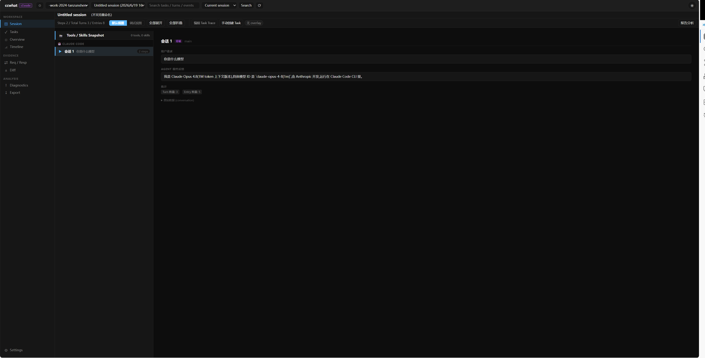

<div align="center">

<a href="https://github.com/PacemakerG/CCWhat">
  <picture>
    <source media="(prefers-color-scheme: dark)" srcset="./docs/assets/readme/logo-dark.png">
    <source media="(prefers-color-scheme: light)" srcset="./docs/assets/readme/logo-light.png">
    
  </picture>
</a>

<h3>End-to-end tracing and observability for AI agents.</h3>

<p>
  <strong>Languages:</strong>
  <a href="./README.md">简体中文</a> ·
  <a href="./README.en.md">English</a>
</p>

<p>
  <strong>Changelog:</strong>
  <a href="./CHANGELOG.md">v2.2.4</a> ·
  <a href="./CHANGELOG.md">更新日志</a>
</p>

</div>

## Preview

| Dark | Light |
| :---: | :---: |
|  |  |

## 😤 你肯定遇到过这种事

- 让 Claude Code 往东，它偏要往西，还自己发明一个新方向
- 让它“参考这个文档”，它秒回“好的，我已经参考了”，实际上连文件都没打开
- 你追问：“你真看了吗？”它理直气壮：“看了。”
- 你翻遍终端日志，也抓不到它“偷懒”的实锤，一肚子火

**别再猜 Agent 做了什么——让每一步都有迹可循。**

## ❓ AgentLens 是什么

AgentLens 只做一件事：

> **把 AI 干活时的所有“小动作”记录下来，放到网页里让你实时围观。**

- 它调用了什么工具
- 它读了哪个文件，还是假装读了其实没读
- 它执行了什么命令，输出是什么
- 它是真的“参考了文档”，还是张口就来

**所有动作，尽收眼底。**

在此基础上，AgentLens 将 Agent 的本地 Session 日志与模型请求记录整理到同一个 Viewer 中，让执行过程可以被搜索、比较、回放和导出。

## ✨ AgentLens 能做什么

### 查看完整执行轨迹

以 `Session → Task → Conversation → Step / Turn` 的结构查看用户请求、Agent 回复、思考过程、工具调用和工具结果。默认视图突出主要执行步骤，调试视图保留完整事件。

### 定位关键上下文

在当前 Session、当前项目或全部项目中搜索 Session、Task、Turn 和事件，并直接跳转到命中位置。通过 Request / Response 页面查看实际模型请求及流式响应。

### 对比与回放

比较相邻 Turn 的结构变化，定位新增、删除和修改的上下文字段。对于包含真实用户消息的历史请求，可以原文回放，也可以修改 Prompt 后重新发送，用于验证响应或比较不同写法。

### 拆分和校正任务

使用本地规则自动切分长 Session，也可以手动创建 Task，或调整、拆分、合并和删除已有 Task 边界，使执行轨迹更适合复盘。

### 生成报告和 Dataset

从当前 Session 生成分析报告；将确认后的 Task 保存为标准 Dataset，包括 `manifest.json`、`dataset.jsonl`、`traces/*.json` 和 `scores.jsonl`，用于后续评测、分析或训练数据转换。

### 导出和分享证据

将 Session 与相关请求记录导出为压缩包，也可以重新导入并在 Viewer 中打开，便于复现问题和协作排查。

## 🚀 安装

### 环境要求

- macOS、Linux 或 WSL
- Python 3.10+
- Windows 原生环境暂不支持

安装脚本会检查 Python，并在需要时安装 `mitmproxy`。

### 安装或更新

```bash
curl -fsSL https://raw.githubusercontent.com/PacemakerG/CCWhat/main/install.sh | bash
```

安装完成后检查版本：

```bash
ccwhat --version
```

### 卸载

```bash
curl -fsSL https://raw.githubusercontent.com/PacemakerG/CCWhat/main/install.sh | bash -s -- uninstall
```

卸载不会删除 `~/.ccwhat` 中的本地配置和记录。

## 📖 使用

### 1. 启动 Agent

在原命令前加上 `ccwhat --`：

```bash
ccwhat -- claude
ccwhat -- codex
ccwhat -- opencode
```

AgentLens 会根据目标 Agent 读取本地配置、启动记录服务，并自动打开 Viewer。首次运行如果仍缺少录制目标，会进入配置引导。

### 2. 查看执行过程

Viewer 默认运行在 `http://127.0.0.1:7789`。如果关闭了页面，可以重新打开：

```bash
ccwhat web --agent claude
ccwhat web --agent codex
ccwhat web --agent opencode
```

进入 Viewer 后，可以：

1. 选择 Agent、项目和 Session。
2. 在 Session 页面查看主要执行步骤或完整调试事件。
3. 在 Tasks 页面自动或手动切分任务，并校正 Task Trace。
4. 使用 Search、Req / Resp、Diff 和 Diagnostics 定位问题。
5. 根据需要生成报告、保存 Dataset 或导出 Session。

### 3. 常用命令

| 命令 | 用途 |
| --- | --- |
| `ccwhat setup` | 修改录制目标和路径配置 |
| `ccwhat discover -- claude` | 只记录流量元数据，发现需要录制的 API 地址 |
| `ccwhat --no-web -- codex` | 启动记录，但不自动打开 Viewer |
| `ccwhat web --agent opencode` | 打开指定 Agent 的 Viewer |
| `ccwhat export --list` | 列出可导出的 Session |
| `ccwhat export <session-id>` | 导出指定 Session |
| `ccwhat import <archive.tar.gz> --open` | 导入压缩包并打开 Viewer |

### 使用自定义模型服务

AgentLens 会尝试从 Claude Code、Codex 和 OpenCode 的本地配置中发现 API 地址。使用中转服务或自定义模型提供商时，如果地址没有被自动识别，可以运行：

```bash
ccwhat setup
```

如果不确定实际请求地址，可以先使用 Discovery 模式：

```bash
ccwhat discover -- claude
```

Discovery 模式只保存请求方法、地址、状态码和内容类型等元数据，不保存请求或响应正文。

## ⚙️ 工作原理

AgentLens 组合两类证据：

1. **Agent 本地日志**：通过独立 Adapter 读取 Claude Code、Codex 和 OpenCode 的原生 Session 数据。
2. **模型请求记录**：通过本地 `mitmproxy` 记录配置范围内的 HTTP / HTTPS 请求与响应。

本地 Viewer 将两类数据关联起来，提供 Session 导航、Task 切分、全局搜索、Turn Diff、请求回放、报告分析和 Dataset 导出。

## 🔐 隐私与安全

- Viewer、配置、请求记录和 Dataset 默认保存在本机。
- `Authorization`、`Cookie`、`Set-Cookie`、`X-API-Key` 等敏感 Header 默认会被替换为 `[REDACTED]`。
- 请求和响应正文仍可能包含 Prompt、代码或其他业务数据，分享导出文件前应自行检查。
- HTTPS 记录需要信任 `mitmproxy` 的本地 CA 证书；AgentLens 只记录配置中匹配的目标地址和路径。
- 不需要保存正文时，优先使用 Discovery 模式。

默认数据目录：

```text
~/.ccwhat/
├── config.toml
├── raw-req-resp/
└── datasets/
```

## 💻 平台支持与限制

| 平台 | 状态 |
| --- | --- |
| macOS | 支持 |
| Linux | 支持 |
| WSL | 支持 |
| Windows 原生环境 | 暂不支持 |

不同 Agent 的本地日志结构和可写能力不同。例如，Codex 和 OpenCode 支持在 Viewer 中重命名 Session；Claude Code 当前不支持从 Viewer 重命名 Session。

## 🤝 开发与贡献

- [架构总览](docs/architecture/ARCHITECTURE.md)
- [多 Agent Log Adapter](docs/architecture/ADAPTERS.md)
- [Analyzer 报告生成协议](docs/architecture/ANALYZER.md)
- [Task Segmentation](docs/TASK_SEGMENTATION.md)
- [Task Dataset](docs/TASK_DATASET_CORE.md)
- [贡献指南](docs/CONTRIBUTING.md)
- [版本路线图](docs/VERSION_ROADMAP.md)
- [更新日志](CHANGELOG.md)

欢迎通过 Issue 提交问题或建议，通过 Pull Request 参与开发。
