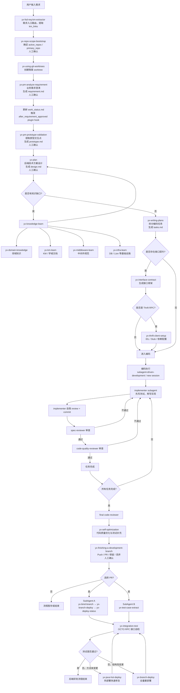

# 元析工作流说明与准确性评估

> 适用场景：用于向同学、导师或项目成员解释“元析 2.0 的 Skill 工作流到底在做什么”，以及判断原始流程图描述是否准确。

---

## 1. 总体判断

这份元析工作流描述**整体是正确的**，主干链路基本符合“从需求输入到开发完成、部署、自测”的后端研发闭环：

```text
用户需求
  → 需求入口标准化
  → 仓库作用域确认
  → 隔离开发环境创建
  → 业务需求澄清
  → 原型交互确认
  → 技术方案设计
  → 编码任务拆分
  → 接口契约准备
  → TDD 编码与多轮 Review
  → 代码质量自优化
  → Push / PR / 部署
  → 集成测试
  → 必要时热部署修复
```

不过，原始描述里有几处容易误解的地方，建议稍微修正：

| 原始表述 | 建议修正 | 原因 |
|---|---|---|
| `yx-java-hot-deploy` 放在 `yx-integration-test` 之后作为线性最后一步 | 改成“集成测试失败后的快速修复分支” | 热部署不是每次都执行，只有方法体级别变更、需要快速验证时才触发 |
| `yx-self-optimization` 写成“代码质量优化 + 集成测试生成” | 改成“代码质量优化，并触发/配合测试用例生成与验证” | 真正结构化生成集成测试用例的是 `yx-test-case-extract` |
| 编码执行完全写成 `subagent-driven-development` | 可以补充“任务较少时走 subagent，任务很多时可能拆到新 session” | 原文快速上手里提到任务数不同会有不同执行模式 |
| 流程图没有显式体现 `work_status.md` 和 plugin hook | 建议在关键人工确认节点后补充“状态更新 + hook 触发” | 这对诊断你同学遇到的“漏埋点/漏 hook”问题很重要 |

---

## 2. 一句话解释元析工作流

**元析工作流本质上是把一个后端需求，从 FSD/KM/文字输入开始，经过需求澄清、方案设计、任务拆分、TDD 编码、代码审查、部署和集成测试，拆成一组可被 Claude Code + Skill 自动执行的标准化研发流程。**

更口语一点：

> 元析不是简单帮你写代码，而是把 Claude Code 包装成一个“懂美团研发流程的 AI 后端工程师”。

---

## 3. 推荐版总流程图

```text
[用户输入需求]
       ↓
  yx-fsd-req-km-extractor
  需求入口路由：提取 KM/FSD/文字需求，统一转换为 km_links
       ↓
  yx-repo-scope-bootstrap
  工程作用域初始化：确定 active_repos、primary_repo（人工确认）
       ↓
  yx-using-git-worktrees
  为每个 repo 创建隔离 worktree，避免污染主工作区
       ↓
  yx-pm-analyze-requirement
  业务需求澄清：生成 requirement.md（人工确认）
       ↓
  状态更新 + after_requirement_approved plugin hook
       ↓
  yx-pm-prototype-validation
  原型交互点提取：生成 prototype.md（人工确认）
       ↓
  yx-plan
  后端技术方案设计：生成 design.md（人工确认）
       ↓
  yx-knowledge-learn（按需）
  补充领域知识、KM 文档、中间件规范、基础设施状态
       ↓
  yx-writing-plans
  编码任务拆分：生成 tasks.md
       ↓
  yx-interface-contract（可选）
  跨服务接口契约落地
       ↓
  yx-thrift-client-setup（可选）
  Thrift RPC 场景下生成 IDL / client stub / 依赖配置
       ↓
  编码执行：subagent-driven-development / new session
       ↓
  yx-self-optimization
  代码质量自优化、测试补充、整体收口
       ↓
  yx-finishing-a-development-branch
  开发收尾：Push / PR / 保留 / 丢弃（人工确认）
       ↓
  若选择 PR：并发触发两条链路
       ├─ SubAgent A：yx-bind-branch → yx-branch-deploy → yx-deploy-status
       │              分支绑定、泳道部署、部署状态检查
       │
       └─ SubAgent B：yx-test-case-extract
                      集成测试用例生成
       ↓
  yx-integration-test
  OCTO RPC 接口自检，生成测试报告
       ↓
  若测试失败且仅方法体变更：yx-java-hot-deploy
  若结构性变更：重新走 yx-branch-deploy 全量部署
       ↓
  后端研发流程结束
```

---

## 4. Mermaid 版本流程图

> 如果你的 Markdown 查看器支持 Mermaid，可以直接渲染下面这段。



---

## 5. 各阶段解释

### 5.1 需求入口路由：`yx-fsd-req-km-extractor`

这一阶段负责接收用户的原始输入。

用户可能输入：

- FSD 链接；
- KM / 学城需求文档链接；
- 一句话需求描述。

该 Skill 会把不同形式的输入统一转成后续流程需要的 `km_links`。这样后面的 Skill 不需要关心用户最初给的到底是什么格式。

核心价值：

> 把“用户随便输入的需求”变成“元析工作流可以消费的标准需求入口”。

---

### 5.2 仓库作用域初始化：`yx-repo-scope-bootstrap`

这一阶段负责判断这个需求到底要改哪些仓库。

它会确定：

- `active_repos`：本次需求涉及的所有仓库；
- `primary_repo`：主开发仓库；
- 是否涉及跨仓库依赖；
- 是否需要同步纳入 client 仓库或接口仓库。

这一阶段有人工确认点。用户确认后，才会继续创建分支和 worktree。

核心价值：

> 防止 AI 一开始就改错仓库、建错分支，先把工程边界确认清楚。

---

### 5.3 隔离开发环境：`yx-using-git-worktrees`

这一阶段会为每个仓库创建独立的 `git worktree`。

`worktree` 可以理解成：

> 同一个 Git 仓库额外拉出一个独立工作目录，专门用于当前需求开发。

好处是：

- 不污染用户原来的工作区；
- 多仓库可以并发处理；
- 出问题时更容易回滚；
- 后续集成测试和热部署仍然能保留现场。

---

### 5.4 业务需求澄清：`yx-pm-analyze-requirement`

这一阶段只关注业务问题，不讨论技术实现。

它要产出：

```text
requirement.md
```

主要内容包括：

- 需求背景；
- 业务规则；
- 用户场景；
- 边界条件；
- 验收标准；
- 待确认问题。

关键点：

> 在 `requirement.md` 获得用户确认之前，不应该进入技术方案和编码阶段。

这里也是你同学遇到问题的关键位置。需求确认后，除了更新 `work_status.md`，还应该触发类似 `after_requirement_approved` 的 plugin hook。否则插件侧可能收不到“需求已确认”的生命周期事件。

---

### 5.5 原型交互提取：`yx-pm-prototype-validation`

这一阶段负责从 PRD / 学城文档 / 原型描述中提取页面交互点。

它要产出：

```text
prototype.md
```

主要内容包括：

- 页面列表；
- 按钮、弹窗、表单等交互点；
- 前端依赖的后端接口行为；
- 尚需确认的交互细节。

核心价值：

> 把 UI 交互行为补充进需求上下文，避免后端方案只看文字需求而漏掉页面真实调用场景。

---

### 5.6 技术方案设计：`yx-plan`

这一阶段负责把已经确认的业务需求和原型行为，转成后端技术方案。

它要产出：

```text
design.md
```

通常会分析：

- 要新增还是修改接口；
- 要改哪些 Service / Manager / DAO；
- 是否涉及 DB 表；
- 是否涉及中间件；
- 是否涉及 Thrift RPC；
- 是否有兼容性风险；
- 是否有跨仓库依赖。

关键点：

> 用户确认技术方案之前，不应该直接写代码。

---

### 5.7 知识补充：`yx-knowledge-learn`

如果 `yx-plan` 发现自己对某些领域知识、接口规范、中间件配置或基础设施状态不确定，就会调用 `yx-knowledge-learn`。

它会进一步调度：

| Skill | 作用 |
|---|---|
| `yx-domain-knowledge` | 补充业务领域知识 |
| `yx-km-learn` | 阅读 KM / 学城文档 |
| `yx-middleware-learn` | 学习中间件使用规范 |
| `yx-infra-learn` | 查询 DB / Lion 等基础设施状态 |

核心价值：

> 不让 AI 凭空设计，而是先补齐内部知识和工程上下文。

---

### 5.8 编码任务拆分：`yx-writing-plans`

这一阶段负责把 `design.md` 拆成真正可执行的任务清单。

它要产出：

```text
tasks.md
```

每个任务一般会包含：

- 要修改的文件路径；
- 要新增的类或方法；
- 是否需要 TDD；
- 测试怎么写；
- 任务依赖关系；
- commit 节点。

核心价值：

> 把“方案”变成“施工清单”，避免 AI 一次性大范围乱改。

---

### 5.9 接口契约落地：`yx-interface-contract`

如果任务中包含跨服务接口或跨仓库调用，就需要先落接口契约。

例如：

- 进程内接口；
- Thrift RPC；
- HTTP REST；
- MQ 消息契约。

这一阶段只生成接口骨架，不写业务逻辑。

核心价值：

> 先确定跨模块/跨服务的边界，让后续编码不被接口不确定性卡住。

---

### 5.10 Thrift 工程准备：`yx-thrift-client-setup`

如果是 Thrift RPC 场景，还需要额外准备：

- `.thrift` IDL；
- Java client stub；
- Maven 依赖；
- 消费方编译验证。

核心价值：

> 把 Thrift 接口从“设计里的描述”变成“工程里可编译、可依赖的契约”。

---

### 5.11 编码执行：`subagent-driven-development`

这是实际写代码的阶段。

每个任务的循环通常是：

```text
读取任务
  → 派发 implementer subagent
  → 先写测试
  → 再写实现
  → 测试通过
  → implementer 自我 review
  → commit
  → spec-reviewer 审查
  → code-quality-reviewer 审查
  → 任务完成
```

如果 Review 不通过，则回到 implementer 修复。

核心价值：

> 让 AI 编码过程更像真实工程开发，而不是“一次性生成一堆代码”。

---

### 5.12 代码质量自优化：`yx-self-optimization`

所有编码任务完成后，会进行 feature 级别的整体质量收口。

可能包括：

- 单元测试全量验证；
- lint 检查；
- 圈复杂度检查；
- 命名一致性检查；
- 集成测试补充；
- 失败后自动诊断和修复。

核心价值：

> 不只看每个小任务是否完成，还要看整个 feature 是否质量达标。

---

### 5.13 开发收尾：`yx-finishing-a-development-branch`

这一阶段让用户选择后续动作：

1. Push；
2. 创建 PR；
3. 保留本地；
4. 丢弃变更。

如果选择创建 PR，元析会并发触发两条链路：

```text
SubAgent A：绑定分支 + 泳道部署 + 部署状态检查
SubAgent B：生成集成测试用例
```

核心价值：

> 把“代码写完”之后的工程动作继续自动化，而不是停在本地改完代码。

---

### 5.14 部署链路：`yx-bind-branch` / `yx-branch-deploy` / `yx-deploy-status`

这条链路负责：

- 把 feature 分支绑定到 FSD / ONES 需求；
- 在 FSD 平台创建研发交付；
- 部署到泳道环境；
- 查询部署结果。

核心价值：

> 让 AI 不只是写代码，还能把代码部署到可测试环境。

---

### 5.15 测试用例生成：`yx-test-case-extract`

这一阶段根据设计文档生成结构化测试用例。

它一般会产出：

```text
test-cases.json
```

主要用于后续 OCTO RPC 接口自检。

注意：

> 测试用例应该主要来自设计文档和需求，而不是照着代码实现反推。否则测试就失去了独立验证价值。

---

### 5.16 集成测试：`yx-integration-test`

这一阶段会读取 `test-cases.json`，通过 OCTO MCP 调用泳道环境中的 RPC 接口。

主要验证：

- 接口是否能调通；
- 参数校验是否正确；
- 核心业务影响是否符合预期；
- 数据状态是否符合需求；
- 失败时到底是环境问题、数据问题还是代码问题。

核心价值：

> 从“代码能编译”进一步验证到“部署后的服务真的能跑通”。

---

### 5.17 热部署：`yx-java-hot-deploy`

热部署不是主流程的必经终点，而是失败修复路径。

触发条件通常是：

- 集成测试失败；
- 已定位为代码问题；
- 修改范围仅限 Java 方法体内部；
- 不涉及新增类、改接口、改依赖等结构性变更。

如果满足这些条件，就可以用热部署快速推送变更，避免完整重新部署。

核心价值：

> 小范围修复时快速验证，减少等待全量部署的时间。

---

## 6. 更准确的最终表述

可以把元析工作流最终表述为：

> 元析基于 Claude Code CLI 和一组美团内部 Skill，将后端研发过程拆解为标准化的自动执行链路。用户输入 FSD、KM 或文字需求后，系统会先完成需求入口标准化、仓库作用域确认和隔离 worktree 创建；随后通过需求澄清、原型提取、技术方案设计和知识补充，生成 `requirement.md`、`prototype.md`、`design.md` 等中间产物；再通过 `tasks.md` 拆分编码任务，并在必要时先落地接口契约。编码阶段采用 TDD 和多轮 subagent review，包括 implementer、spec-reviewer、code-quality-reviewer 和 final code-reviewer。开发完成后，系统进行代码质量自优化，并在用户确认后执行 Push / PR、分支绑定、泳道部署、测试用例生成和 OCTO RPC 集成测试。若测试失败且仅涉及方法体变更，可通过热部署快速修复；若为结构性变更，则重新走全量部署。整体目标是把“需求到提测前自检”的后端研发流程自动化、规范化、可追踪化。

---

## 7. 和你同学问题的关系

你同学遇到的“没有按照 `yx-pm-analyze-requirement/SKILL.md` Trigger plugin hook 要求埋点”的问题，就发生在这个流程中的关键节点：

```text
yx-pm-analyze-requirement
  → requirement.md 人工确认
  → work_status.md 状态更新为 requirements_approved
  → 应触发 after_requirement_approved plugin hook
  → 再进入 yx-plan
```

如果实际日志中变成了：

```text
状态更新成功
  → 直接进入 yx-plan
```

而没有执行：

```text
plugin_dispatcher.py --event after_requirement_approved
```

那么就可以判断：

> 主流程虽然继续往后走了，但插件生命周期事件漏触发了，导致埋点/插件执行记录缺失。

这类问题对你现在做的 CodeLens-Agent / deep-ai-analysis 很重要，因为它正好说明：

> 只看最终代码有没有生成是不够的，还要观察 Skill 生命周期、状态流转、hook 执行、subagent 调度是否完整。
